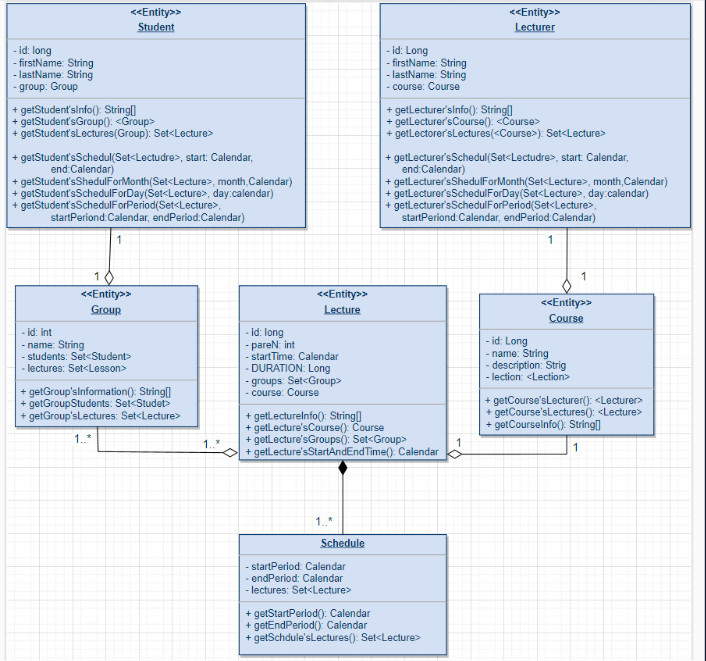

# UNIVERSITY-SCHEDULER

___

## Purpose

>The purpose of the application is to *randomly* create a thousand students, a hundred lecturers. Enroll all students in
*randomly* generated groups, and assign courses to lecturers. Randomly enroll each group in several courses, and then
generate a class schedule for each group.

Create user account for each student with the role *"STUDENT"*, a lecturer with the role *"LECTURER"*, and also create
several users for the staff with the role *"STAFF"* and administrators with the role *"ADMIN"*.
Each role have different *rights* or *access levels*.

___

## Used technologies:

> 1. [x] **PostgreSQL 14.6**
> 2. [x] **Bootstrap 5.3.2**
> 3. [x] **Docker compose 3.2.0**
> 4. [x] **Java JDK-19**
> 5. [x] **Spring framework 3.2.0** :
>> + [x] Web
>> + [x] Security
>> + [x] Security test
>> + [x] Junit-5 Jupiter
>> + [x] Test containers
>> + [x] MVC (Model View Controller)
>> + [x] Flyway
>> + [x] JPA (Java Persistence Api)
>> + [x] Thymeleaf

---

## Tests

#### Created 288 tests.

- [x] Unit tests 267 passed.
- [x] Integration test 21 passed.

___

## Application structure

 

___

## UI screenshots

> [Click here to see screenshots.](screenshots/csreenshots.md) 

___

## Installation

In command line open *main* directory of application and use command **'docker-compose up -d'** for 
run application in docker container on *detached* mode.

## Authors

Author *Zvieriev Vladyslav*. 

> ## Project complete.
