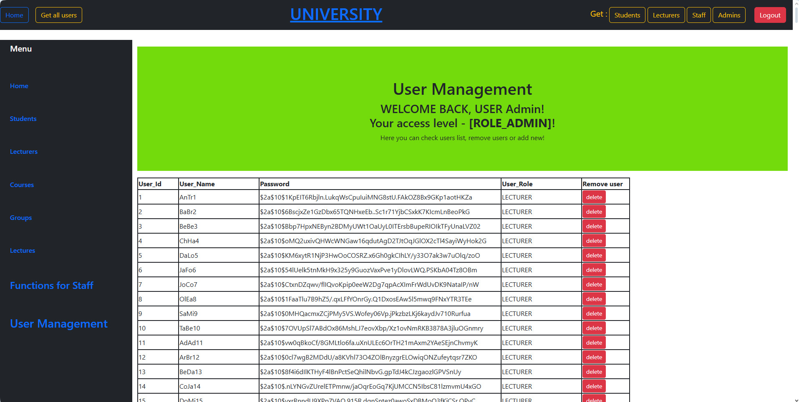

# UI screenshots

#### Main page for guest

#### Courses list for role Admin

#### Courses list for role Admin

#### Courses list for role Stuff

#### Courses list for role Student 

#### Common timetable for role Lecturer

#### List of lectures for role Lecturer

#### List of lecturers for role Admin

#### Weekly schedule for lecturer with id = 77 with role Lecturer

#### Weekly schedule for lecturer with id = 77 with role Lecturer

#### Timetable of all courses for 5 days with role Lecturer

#### Timetable for student with id=5 for 15 days by role Lecturer

